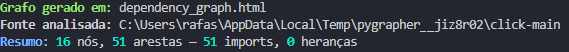
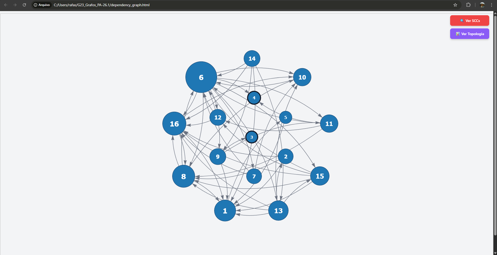
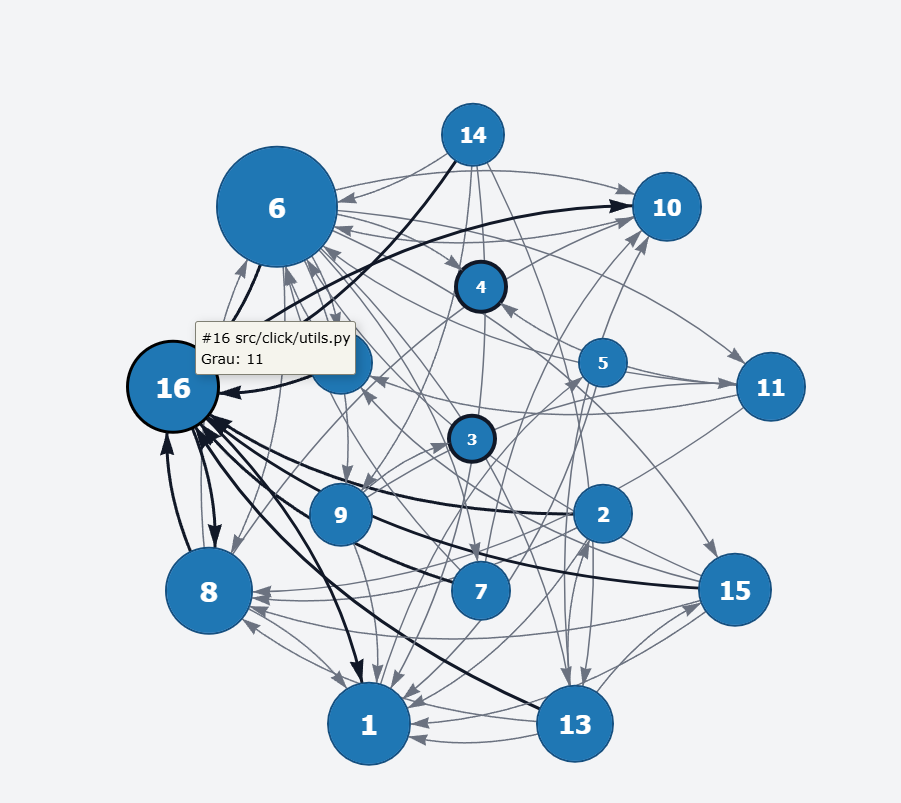
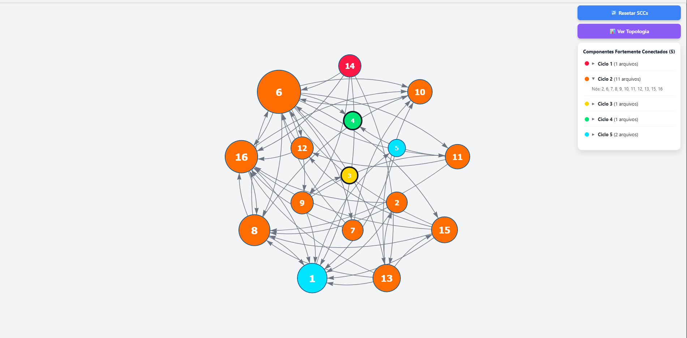
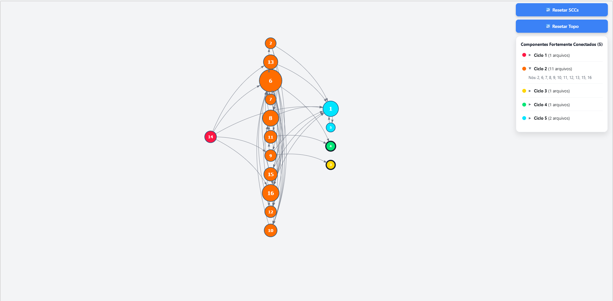

# Analisador de Repositórios

**Número da Lista**: 1<br>
**Conteúdo da Disciplina**: Grafos<br>

## Alunos
| Matrícula | Aluno |
| -- | -- |
| 23/1011220 | Davi Camilo Menezes |
| 23/1011800 | Rafael Welz Schadt |

## Sobre
O **Analisador de Repositórios** é um projeto que tem como objetivo analisar repositórios escritos em Python por meio da modelagem de suas dependências como grafos direcionados. A proposta consiste em aplicar conceitos do conteúdo de Grafos em um contexto prático, permitindo identificar relações entre módulos, ciclos de importação e aspectos estruturais da organização do código.

Seu funcionamento ocorre em etapas. Inicialmente, o sistema percorre os arquivos Python de um repositório e extrai, via análise sintática, informações como imports, classes e relações de herança. Em seguida, esses dados são utilizados para construir um grafo direcionado, sobre o qual são aplicados algoritmos como detecção de Componentes Fortemente Conectados e Ordenação Topológica. Por fim, os resultados são apresentados em uma visualização interativa, favorecendo a interpretação da arquitetura e das dependências do projeto analisado.

## Screenshots
A seguir estão imagens do projeto em funcionamento.

- Resultado da execução do comando:
```bash
python main.py --repo https://github.com/pallets/click
```


- Grafo gerado:


- Grafo Iterativo, é possível ver quantas arestas se conectam e qual arquivo aquele nó representa.


- SCCs identificadas e coloridas.


- Ordenação topológica feita.


## Instalação
**Linguagem**: Python<br>
**Framework**: Não foi utilizado<br>
**Pré-requisitos:** Todos os requirements instalados<br>

### Como rodar

1. Instalar as dependências

```bash
python -m pip install -r requirements.txt
```

2. Executar a análise de um repositório remoto do GitHub

```bash
python main.py --repo URL
```
> Onde URL se refere ao **link do repositório** que você quer analisar.

Exemplo:
```bash
python main.py --repo https://github.com/pallets/click
```
> Esse comando analisa o repositório informado, constrói o grafo de dependências e gera o arquivo `dependency_graph.html`.

Entretanto, além disso, o trabalho possui diferentes modos para gerar grafos, com focos distintos, de um mesmo repositório, os quais estão descritos abaixo:

| Nome | Descrição |
| --- | --- |
| `--mode imports` (padrão) | Mostra as relações de importação entre arquivos do projeto. |
| `--mode packages` | Exibe apenas imports que apontam para módulos inteiros, ignorando imports de classes específicas, produzindo, dessa forma, um grafo mais limpo e menos denso. |
| `--mode class-imports` | Exibe apenas imports cujo alvo é uma classe específica dentro de um módulo, revelando quais classes são mais usadas pelo projeto. |
| `--mode classes` | Mostra apenas relações de herança entre classes, ignorando imports, sendo útil, assim, para ver a hierarquia OOP do projeto. |
| `--mode full` | Combina imports e herança no mesmo grafo (mais completo). |

Para adicionar o modo, basta digitar o **nome do modo na frente do comando**.

Exemplo:
```bash
python main.py --repo https://github.com/pallets/click --mode classes
```

**Observações**
- Se nenhum modo for informado, o projeto utilizará `--mode imports`.
- O resultado é salvo em um arquivo HTML interativo, o qual é aberto automaticamente no navegador.
- Se `python` não estiver disponível no seu terminal, use `python3` nos comandos acima.

## Uso 
Após a execução do comando e gerar o html, haverá dois botões no canto direito superior da tela.
- Ver SCCs (classifica os componentes fortemente conectados do grafo apresentado, em diferentes cores, identificando cada um)
- Ver Topologia (coloca em ordem de graus de saída/entrada, de acordo com os componentes fortemente conectados gerados)

## Vídeo de Apresentação
Link para o vídeo de apresentação e demonstração do trabalho:  

